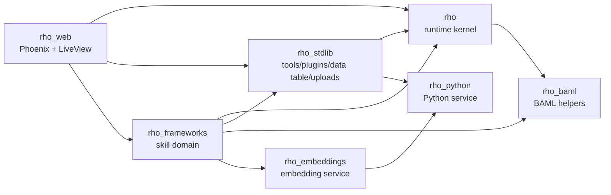

# Rho Codebase Map For Future Codex Work

Generated: 2026-05-15

This note is a compact working map of the Rho umbrella. Use it before making code changes so you can find the right app, boundary, behaviour, and verification path quickly.

## System Shape

Rho is a seven-app Elixir umbrella:

| App | Role | Depends on |
| --- | --- | --- |
| `rho` | Core runtime kernel: sessions, agents, runner, tools, plugins, transformers, tapes, traces, conversations, events. No Phoenix/Ecto. | `rho_baml`, `req_llm`, `phoenix_pubsub`, `jason`, `nimble_options`, `dotenvy` |
| `rho_stdlib` | Built-in tools/plugins, data table server, uploads, skills, effect dispatching. | `rho`, `rho_python` |
| `rho_baml` | BAML/Zoi schema generation for static and dynamic structured-output calls. | external only |
| `rho_python` | Python runtime service and dependency/config bridge. | external only |
| `rho_embeddings` | Embedding server and backends. | `rho_python` |
| `rho_frameworks` | Skill assessment domain: accounts, libraries, roles, lenses, flows, use cases, repo schemas. | `rho`, `rho_stdlib`, `rho_baml`, `rho_embeddings` |
| `rho_web` | Phoenix/LiveView edge: sessions, workspaces, projections, pages, components, auth. | `rho`, `rho_stdlib`, `rho_frameworks` |

## Primary Runtime Flow

1. `Rho.Session.start/1` is the public API used by web, CLI, and tests.
2. `Rho.RunSpec.FromConfig.build/2` loads `.rho.exs` via `Rho.AgentConfig`, resolves plugins through `Rho.Stdlib.resolve_plugin/1`, and returns an explicit `Rho.RunSpec`.
3. `Rho.Agent.Primary.ensure_started/2` starts a primary `Rho.Agent.Worker` for the session.
4. `Rho.Agent.Worker` bootstraps tape memory, optional sandbox, runtime context, and plugin-derived capabilities.
5. A submitted turn calls `Rho.Runner.run/2`.
6. `Rho.Runner` owns the outer loop: step budget, prompt merge, tape recording, compaction, tool dispatch, transformer stages, and final result classification.
7. `Rho.TurnStrategy.Direct` or `Rho.TurnStrategy.TypedStructured` owns the inner turn: LLM/BAML call and response/action classification.
8. Tool calls flow through `Rho.ToolExecutor`, which applies `:tool_args_out`, runs tools concurrently, applies `:tool_result_in`, normalizes results, and emits events.
9. `Rho.Recorder` writes durable tape entries. `Rho.Trace.Projection` rebuilds chat/debug/cost/failure views from tape.
10. `Rho.Events` broadcasts lifecycle, text, tool, data table, workspace, and custom signals across the session.

## Core Behaviours And Extension Points

| Behaviour | Implementations / Users | Purpose |
| --- | --- | --- |
| `Rho.Plugin` | stdlib plugins/tools, `RhoFrameworks.Plugin` | Contribute tools, prompt sections, bindings, signal handlers. |
| `Rho.Transformer` | `Rho.Stdlib.Plugins.StepBudget`, `Rho.Stdlib.Transformers.SubagentNudge`, test policies | Cross-cutting policy/mutation stages. |
| `Rho.TurnStrategy` | `Direct`, `TypedStructured` | Inner LLM turn and intent classification. |
| `Rho.Tool` | framework tool modules, many stdlib tools | Compile-time DSL for tool definitions and execution callbacks. |
| `Rho.Tape.Projection` | `Rho.Tape.Projection.JSONL` | Durable append-only memory projection. |
| `RhoFrameworks.UseCase` | import, merge, diff, suggest, proficiency, skeleton, research flows | Domain operations shared by chat tools and flow UI. |
| `RhoFrameworks.Flow` | `CreateFramework`, `EditFramework`, `FinalizeSkeleton` | Declarative workflow node graph. |
| `RhoFrameworks.Flow.Policy` | deterministic, hybrid | Chooses next flow edge. |
| `RhoWeb.Projection` | chatroom, data table, lens dashboard, session state | Pure reducers for UI-facing state. |
| `RhoWeb.Workspace` | chatroom, data table, lens dashboard | Pluggable workbench surfaces. |

## App Module Map

### `apps/rho`

Core clusters:

- Session/API: `Rho`, `Rho.Session`, `Rho.Session.Handle`, `Rho.AgentConfig`, `Rho.RunSpec`, `Rho.RunSpec.FromConfig`, `Rho.Config`.
- Agent processes: `Rho.Agent.Worker`, `Primary`, `Registry`, `Supervisor`, `EventLog`, `LiteTracker`.
- Loop internals: `Rho.Runner`, `Rho.Recorder`, `Rho.ToolExecutor`, `Rho.TurnStrategy.*`, `Rho.ActionSchema`, `Rho.SchemaCoerce`, `Rho.StructuredOutput`, `Rho.ToolArgs`, `Rho.ToolResponse`.
- Plugin/transformer kernel: `Rho.Plugin`, `PluginRegistry`, `PluginInstance`, `Rho.Transformer`, `TransformerRegistry`, `TransformerInstance`, `Rho.Context`, `Rho.PromptSection`.
- Durable memory/debug: `Rho.Tape.*`, `Rho.Conversation.*`, `Rho.Trace.*`, `Rho.Parse.Lenient`.
- Coordination: `Rho.Events`, `Rho.Events.Event`, `Rho.SessionOwners`, `Rho.LLM.Admission`.
- Effects: `Rho.Effect.Table`, `Rho.Effect.OpenWorkspace`.
- Mix tasks: `rho.run`, `rho.trace`, `rho.debug`, `rho.smoke`, `rho.verify`, `rho.regen_baml`, `rho.credence`.

### `apps/rho_stdlib`

Core clusters:

- Plugin registry shorthands: `Rho.Stdlib`.
- Tools: bash, fs read/write/edit, web fetch/search, Python, sandbox, finish/end-turn, tape/debug-tape/path-utils.
- Plugins: data table, uploads, multi-agent, py-agent, live-render, step-budget, tape, debug-tape, control, doc-ingest, skills.
- Data table: `Rho.Stdlib.DataTable`, `Server`, `Table`, `Schema`, `Schema.Column`, `ActiveViewListener`, `SessionJanitor`, `WorkbenchContext`.
- Uploads: registry-facing client, server, supervisor, handle, observation, observers for csv/excel/pdf/prose/image/hints, janitor.
- Bridge: `Rho.Stdlib.EffectDispatcher` consumes `Rho.Effect.*` from tool results and writes data table / workspace events.

Important invariant: named tables are explicit. Agents must pass `table:` after loading a named table; server-side active table is UI context, not an implicit write target.

### `apps/rho_baml`

Core clusters:

- `RhoBaml.SchemaCompiler`: Zoi schema to BAML classes/functions.
- `RhoBaml.SchemaWriter`: runtime tool definitions to discriminated action union for typed structured turns.
- `RhoBaml.Function`: compile-time static BAML function module macro.
- `RhoBaml`: top-level helper, especially `baml_path/1`.

Ownership invariant: `rho_baml` owns code, not consumer `.baml` files. Static functions live in consumer app `priv/baml_src`; dynamic agent action schemas are written under `apps/rho/priv/baml_src/dynamic`.

### `apps/rho_python`

Core clusters:

- `RhoPython.Server`: singleton GenServer for declared dependencies, py-agent config, initialization.
- `RhoPython.Application`: starts the server.

### `apps/rho_embeddings`

Core clusters:

- `RhoEmbeddings.Server`: readiness, model name, embed-many calls.
- `RhoEmbeddings.Backend`: behaviour.
- `Backend.OpenAI`, `Backend.Fake`: concrete providers.

Used primarily by framework role/skill search and dedup workflows.

### `apps/rho_frameworks`

Core clusters:

- Domain persistence: `RhoFrameworks.Repo`, Ecto schemas under `Frameworks.*`, accounts/org membership under `Accounts.*`.
- Library/role/lens APIs: `RhoFrameworks.Library`, `Roles`, `Lenses`, `GapAnalysis`, `Workbench`, `DataTableOps.*`, `DataTableSchemas`.
- Agent plugin/tools: `RhoFrameworks.Plugin`, `Tools.LibraryTools`, `RoleTools`, `LensTools`, `SharedTools`, `WorkflowTools`.
- Use cases: import, load/list/save libraries, diff/merge/resolve conflicts, suggest skills, generate skeletons/proficiency, identify gaps, research, load similar roles, extract JD.
- Flows: `RhoFrameworks.Flow`, `FlowRunner`, `Flows.CreateFramework`, `EditFramework`, `FinalizeSkeleton`, `Flow.Policies.*`.
- BAML LLM function modules: `RhoFrameworks.LLM.*`.
- Import/demos/tasks: ESCO import, hiring demo, backfill/eval tasks.

Design invariant: workflow tools wrap `UseCases.*`; the flow UI also uses the same use cases through `FlowRunner`.

### `apps/rho_web`

Core clusters:

- Phoenix shell: `Endpoint`, `Router`, `Application`, auth plugs, user auth, rate limiting.
- Root LiveView: `RhoWeb.AppLive` owns org-scoped navigation, session state, workspaces, uploads, command palette, and page-specific assigns.
- Session subsystem: `SessionCore`, `SignalRouter`, `Snapshot`, `Threads`, `SessionEffects`, `Shell`, `Welcome`.
- Workspace/projection system: `RhoWeb.Workspace`, `Workspace.Registry`, `Workspaces.*`, `Projection`, `Projections.*`.
- UI components: chat, agent drawer, data table, flow, lens dashboard/charts, command palette, research panel, routing chip, step chat, core/layout components.
- Pages/live modules: login/registration, org settings/members/picker, libraries, roles, flow, admin LLM admission.
- Workbench actions: action registry/runner/component/presenter.

Important UI invariant: `SessionState`/projections are the pure state reducers; `SessionEffects` is the impure boundary that dispatches pushes, timers, and `Rho.Effect.*`.

## Cross-App Relationship Map



## Hot Paths For Common Coding Tasks

- Add a new agent tool: prefer `use Rho.Tool`; for generic tools, add to `rho_stdlib`; for skill-domain tools, add to `rho_frameworks/tools/*` and aggregate through `RhoFrameworks.Plugin`.
- Add cross-cutting policy: implement `Rho.Transformer`, register it, and choose the right stage (`:prompt_out`, `:response_in`, `:tool_args_out`, `:tool_result_in`, `:post_step`, `:tape_write`).
- Change LLM loop behaviour: inspect `Rho.Runner`, the chosen `Rho.TurnStrategy`, `Rho.ToolExecutor`, `Rho.Recorder`, and trace projection tests.
- Change durable chat/debug output: change tape entries/projections first; conversations/threads are metadata over tapes.
- Change framework generation/editing: start with `RhoFrameworks.UseCases.*`; then update `Tools.WorkflowTools` and/or `FlowRunner` flow nodes only if needed.
- Change data-table UX: trace `Rho.Stdlib.DataTable.Server` -> `Rho.Events` -> `RhoWeb.Projections.DataTableProjection` / `RhoWeb.DataTableComponent`.
- Change upload handling: inspect `Rho.Stdlib.Uploads.*`, observers, `RhoWeb.AppLive` upload setup, and `SessionCore`.
- Change web session behaviour: start at `RhoWeb.AppLive`, `RhoWeb.Session.SessionCore`, `SignalRouter`, `SessionState`, and `SessionEffects`.

## Verification Defaults

After code changes, run:

```bash
mix rho.slop.strict --format oneline
mix rho.credence
```

Use targeted tests first when the affected area is clear:

```bash
mix test --app rho
mix test --app rho_stdlib
mix test --app rho_frameworks
mix test --app rho_web
```

Broader or boundary-changing work should use:

```bash
mix rho.quality
```

